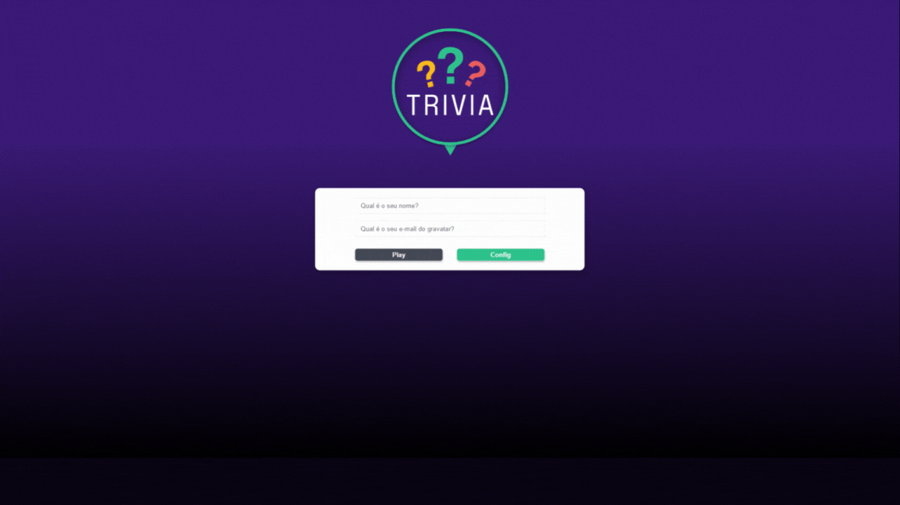

# React Trivia
> [Site Demo](hhtps://jackcaio.github.io/reacttrivia)

> Projeto feito durante módulo de Front-End do curso da [Trybe](https://www.google.com). Busca questões da API [Open Trivia DB](https://opentdb.com) e gera um leaderboard local.

### Ajustes e Melhorias

Próximos passos no desenvolvimento do projeto.

- [x] Publicação de Demo em portfólio githubpages.
- [ ] Implementação de Configurações para jogo.

## Usando

- Crie seu Perfil de Jogo com nome e o email do [Gravatar](https://gravatar.com) (Usado para imagem do perfil).
- Respoda às perguntas o melhor que você puder.
  - Perguntas Verdes são fáceis;
  - Perguntas Amarelas são médias;
  - Perguntas Vermelhas são difíceis;
- Ao final do jogo veja sua pontuação com um feedback.

## Desenvolvimento

Projeto desenvolvido em ambiente Ubuntu, com Node 16.
Foram utilizados ReactJS, React Redux, consumo de APIs, e React Testing Library (RTL) durante o desenvolvimento do projeto. Também foi criado um Trello para organização da equipe.

## Colaboradores

As seguintes pessoas participaram do grupo desenvolvendo este projeto:

<table>
  <tr>
    <td align="center">
      <a href="https://github.com/jackcaio">
         
        
          <b>Caio (Jack) Iack</b>
        
      </a>
    </td>
    <td align="center">
      <a href="https://github.com/brunoopinheiro">
         
        
          <b>Bruno Pinheiro</b>
        
      </a>
    </td>
    <td align="center">
      <a href="https://github.com/gabrieldota">
         
        
          <b>Gabriel Dota</b>
        
      </a>
    </td>
    <td align="center">
      <a href="https://github.com/viniciushirata">
         
        
          <b>Vinicius Hirata</b>
        
      </a>
    </td>
    <td align="center">
      <a href="https://github.com/jonasdamasceno">
         
        
          <b>Jonas Damasceno</b>
        
      </a>
    </td>
  </tr>
</table>